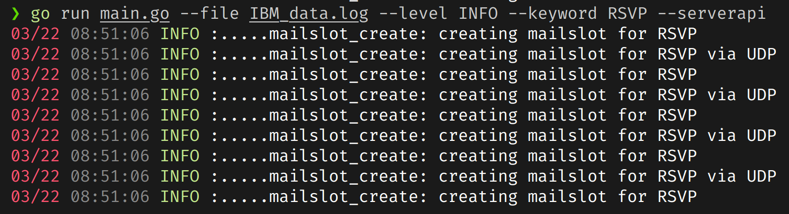

# Enhance Logs

Enhance Logs is a command-line log filtering tool written in Go. It provides a flexible and customizable way to filter log entries based on log levels, custom keywords, and save the API responses to a log file. Additionally, it generates a formatted JSON log file containing date, time, keyword, and message to mock an API response.

## Installation

To install the Enhance Logs, you need to have Go installed on your machine. If you don't have Go installed, you can download it from the official website [here](https://golang.org/dl/).

After installing Go, clone the repository and run the following command to install the Enhance Logs:

```bash
go install
```

## Usage

### Command Line Options

- **-level**: Log level to filter (INFO, ERROR, WARN, etc.).
- **-keyword**: Custom keyword to filter logs.
- **-file**: Path to the log file.
- **-serverapi**: Save API response to a log & JSON file.

### Examples

Running for a dummy IBM log file, printing the logs with level INFO and RSVP keyword, then saving the API response to a log and JSON file. Outputs are:
* [JSON](./apiresponse.json)
* [LOG](./apiresponse.log)


## Scope

This is just a small tool, but it can be scaled to add more features and also can be converted to an API which can serve log files to a user friendly interface.